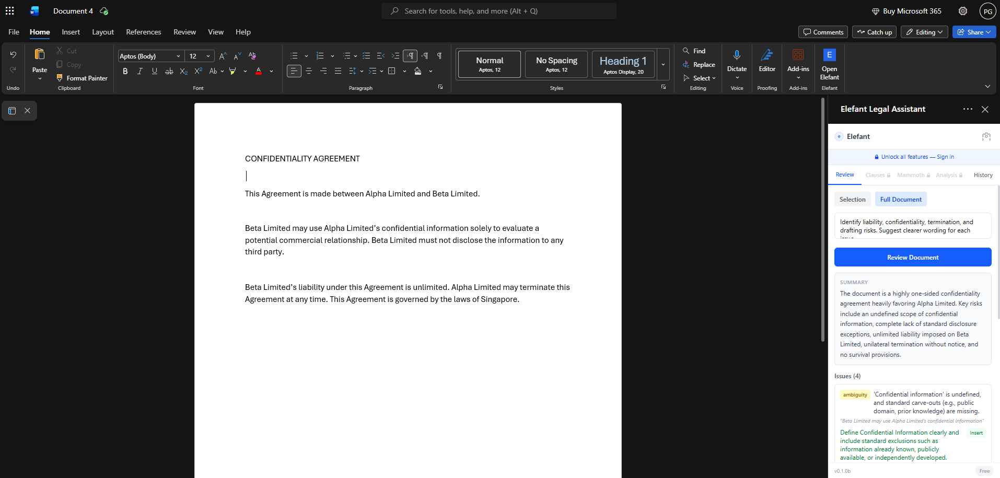

# Elefant for Microsoft Word

AI-powered legal document review and analysis, directly inside Microsoft Word.

[](LICENSE)



Elefant helps legal professionals review documents, identify risks, explore clauses, and work with legal requests without leaving Microsoft Word.

## Features

- Review selected text or an entire Word document.
- Identify drafting, liability, confidentiality, and termination risks.
- Receive structured summaries and suggested wording.
- Insert suggested changes into the document.
- Search and browse clause databases with Elefant Pro.
- Access legal requests, full analysis, and review history.
- Use your own Gemini API key or sign in to Elefant Pro.

## Free BYOK and Elefant Pro

| Feature | Free BYOK | Elefant Pro |
|---|---:|---:|
| Document review | Yes | Yes |
| Review service | Google Gemini | Elefant service |
| Access | Your Gemini API key | Elefant account |
| Clause database | — | Yes |
| Mammoth legal requests | — | Yes |
| Full analysis | — | Yes |
| History | Local review history | Elefant account job history |

BYOK means **bring your own key**. Free-tier users can create a Gemini API key through [Google AI Studio](https://aistudio.google.com/apikey).

## Using Elefant

1. Open Elefant from the Word ribbon.
2. Choose **Selection** or **Full Document**.
3. Optionally enter specific review instructions.
4. Select **Review Document**.
5. Review the summary, identified issues, and suggested wording.
6. Insert useful suggestions into the document where appropriate.

Always review AI-generated legal output before relying on or inserting it.

## User installation

### Word on the web

1. Download the [production manifest](https://elefant-word-245916757771.us-central1.run.app/manifest.xml).
2. Open a document in Word on the web.
3. Open **Add-ins** and select **More Add-ins**.
4. Choose **My Add-ins** → **Upload My Add-in**.
5. Select the downloaded `manifest.xml`.

### Windows desktop

Download and run:

[Install Elefant for Windows](https://elefant-word-245916757771.us-central1.run.app/install-windows.bat)

You can also sideload the production manifest manually through Microsoft Word.

### macOS desktop

Download and run:

[Install Elefant for macOS](https://elefant-word-245916757771.us-central1.run.app/install-mac.command)

You can also sideload the production manifest manually.

For detailed platform-specific instructions, see the [user installation guide](agent_docs/2026-03-05-user-install-guide.md).

## Privacy and data handling

### Free BYOK

- The Gemini API key is stored locally in browser storage.
- When a free review runs, the API key and selected text or document content are sent to Google Gemini.
- Google’s handling of unpaid API usage may depend on the user’s location and account terms. See the [Gemini API terms](https://ai.google.dev/gemini-api/terms).
- Users should review their organisation’s policies before processing client material.

### Elefant Pro

Elefant Pro requests are sent to the Elefant service and processed according to the account and organisation configuration.

Do not process confidential client documents unless your organisation has approved the relevant service and data-handling terms.

## Quick start for development

### Prerequisites

- Node.js
- pnpm 10
- Microsoft Word
- Office Add-in development certificates

Install dependencies, create the local certificates, and start Vite:

```bash
pnpm install
pnpm run certs
pnpm dev
```

The development server runs at `https://localhost:5173`.

Open Word, sideload `manifest.xml`, and open Elefant from the ribbon. The task pane will load from the local development server.

## Architecture

```text
src/
├── api/           # HTTP clients for auth, review, clauses, Mammoth, and jobs
├── components/    # React UI, panels, settings, and upgrade prompts
├── hooks/         # Shared React hooks
├── lib/           # Agent, history, Office.js, and polling logic
├── store/         # Authentication, settings, and UI state
└── types/         # TypeScript types
```

**Stack:** React 19, Tailwind CSS 4, Vite 7, TypeScript 5, Vitest, Playwright, and Office.js.

**Backend:** The paid tier calls the Elefant API through the configured Elefant endpoint. The free BYOK tier calls Google Gemini directly by default. `VITE_GEMINI_BASE_URL` can opt a build into a proxy.

## Testing

```bash
pnpm test
pnpm build
pnpm test:e2e
```

- `pnpm test` runs the Vitest component and logic tests.
- `pnpm build` type-checks and builds the production application.
- `pnpm test:e2e` runs the Playwright end-to-end tests.

Before submitting a change, run:

```bash
pnpm test
pnpm build
git diff --check
```

## Environment variables

Copy `.env.example` to `.env`:

```env
VITE_API_URL=https://elefant.legal/api/v4
# VITE_GEMINI_BASE_URL=
```

`VITE_GEMINI_BASE_URL` is an optional proxy override for the free tier. When unset, which is the production default, the add-in calls Google Gemini directly. When set, requests and the user’s Gemini key go through that host.

These values are embedded into the application at build time through Vite’s `import.meta.env`.

## Deployment

### Prerequisites

- Docker with buildx support for `--platform linux/amd64`
- An authenticated `gcloud` CLI
- Access to the Google Cloud project
- Artifact Registry access

Authenticate and configure Docker:

```bash
gcloud auth login
gcloud config set project "$GCP_PROJECT"
gcloud auth configure-docker us-central1-docker.pkg.dev
```

### Deploy to Cloud Run

```bash
pnpm run deploy
```

This command:

1. Type-checks the application with `tsc`.
2. Builds the SPA with Vite into `dist/`.
3. Builds an `nginx:alpine` Docker image with the production manifest.
4. Pushes the image to Artifact Registry.
5. Deploys the `elefant-word` service to Cloud Run in `us-central1`.

**Production service:**

`https://elefant-word-245916757771.us-central1.run.app`

### Verify after deployment

```bash
# SPA loads
curl -s -o /dev/null -w "%{http_code}" \
  https://elefant-word-245916757771.us-central1.run.app/

# Manifest is served
curl -s \
  https://elefant-word-245916757771.us-central1.run.app/manifest.xml |
  head -5

# macOS installer is downloadable
curl -s -o /dev/null -w "%{http_code}" \
  https://elefant-word-245916757771.us-central1.run.app/install-mac.command

# Windows installer is downloadable
curl -s -o /dev/null -w "%{http_code}" \
  https://elefant-word-245916757771.us-central1.run.app/install-windows.bat
```

## CI/CD

`cloudbuild.yaml` defines the automated Google Cloud build and deployment process.

It:

1. Builds the production application.
2. Creates the Docker image.
3. Tags the image with `$COMMIT_SHA` for traceability.
4. Pushes the image to Artifact Registry.
5. Deploys it to Cloud Run.

To connect it manually:

1. Open **Cloud Build → Triggers** in Google Cloud.
2. Connect the `elegantelefant/word` GitHub repository.
3. Create a trigger for pushes to `main`.
4. Configure the trigger to use `cloudbuild.yaml`.

GitHub Actions runs the repository’s automated test and build checks for pushes and pull requests.

## Manifests

| File | Purpose | Task-pane origin |
|---|---|---|
| `manifest.xml` | Local development | `https://localhost:5173` |
| `manifest.prod.xml` | Production | `https://elefant-word-245916757771.us-central1.run.app` |

The Dockerfile copies `manifest.prod.xml` to `/usr/share/nginx/html/manifest.xml`. Production therefore serves the correct manifest from `/manifest.xml`.

## nginx

`nginx.conf` handles:

- CORS headers required by the Office add-in.
- The Content Security Policy for the Word task pane.
- The `application/xml` content type for the manifest.
- `Content-Disposition: attachment` for `.command` and `.bat` installers.
- SPA fallback through `try_files` and `index.html`.
- One-year caching for Vite-hashed assets under `/assets/`.

When application endpoints or external resources change, update the Content Security Policy and its tests together.

## Contributing

Issues and pull requests are welcome.

When changing user-visible behaviour:

- Describe the change from the user’s perspective.
- Add or update regression tests.
- Preserve existing tests rather than replacing unrelated coverage.
- Include screenshots for visual changes.

## License

This project is licensed under the [Apache License 2.0](LICENSE).