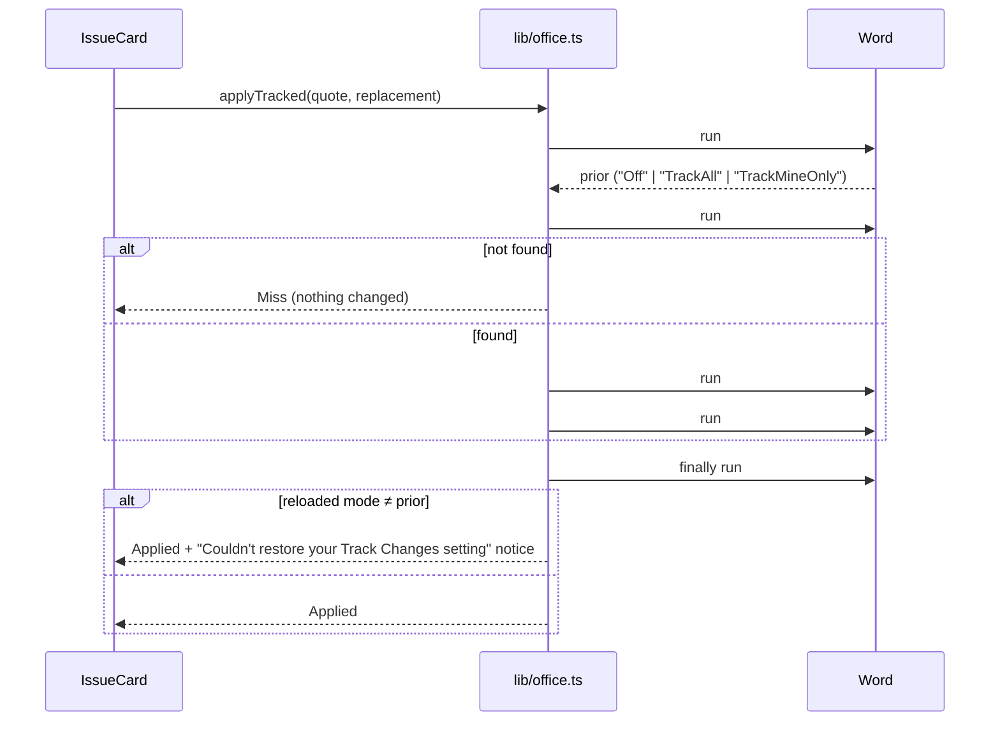

# W1 — tracked-changes insertion + anchored comments (spec)

Program item W1 in rumble `agent_docs/2026-09-22-credible-delightful-local-first-plan.md`
§4 (resized **L** by the adversarial feasibility review, §9). Constraints carried from
the plan, non-negotiable:

- WordApi 1.4 (`changeTrackingMode`, `Range.insertComment`) is absent on volume-licensed
  Office LTSC 2021 / 2019 — the fallback is **non-mutating**: show the suggestion, change
  the document only on explicit confirmation, never a silent untracked edit.
- The user's own tracking mode is saved and restored.
- One quote-anchoring algorithm, shared as a spec with rumble **R2**: the LLM emits a
  verbatim quote, the client finds the first match. Character offsets are forbidden.

Builds on the **PR #27** shapes (`ReviewIssue` = `category / severity / recommendation /
clauseReference / sourceFilename / description / explanation`, mirroring contract
`ReviewIssueResult`, elefant-api 0.305.0). #27 is still DRAFT; W1 implementation is
gated on it merging. Spec only — no code changes in this PR. All API claims cite
learn.microsoft.com (fetched 2026-09-29) or OfficeDev/office-js issues.

## 1. Capability matrix

WordApi 1.4 minimums, from the requirement-set availability table [R1]:

| Host | WordApi 1.4 (`changeTrackingMode`, `insertComment`) | Evidence |
|---|---|---|
| Word on the web | Yes ("Supported") — but see known issues below | [R1] |
| Microsoft 365 subscription, Windows | Yes, Version 2208 (Build 15601.20148)+ | [R1] |
| Retail perpetual Office 2021 (Home & Business, Professional) | **Yes** — retail updates on the monthly train, currently Version 2609 | [R1], [R5] |
| Retail perpetual Office 2019 / 2016 C2R | Yes technically (reached Version 2508 before end of support 2025-10-14); unsupported product | [R1], [R6] |
| Office 2024 / **LTSC 2024** (volume) | **Yes** — table lists "Office 2024: Version 2208" in the LTSC column | [R1] |
| **Office LTSC 2021** (volume) | **No** — frozen at Version 2108 (Build 14334.x) < 2208; not listed for 1.4 | [R1], [R5] |
| **Office 2019** (volume) | **No** — frozen at Version 1808; table's LTSC column tops out at WordApi 1.3 for Office 2019 | [R1], [R6] |
| Office 2016 MSI (volume) | **No** — WordApi 1.1 only | [R1] |
| Mac (M365 / current builds) | Yes, 16.64+ | [R1] |
| iPad | Yes, 16.64+ | [R1] |

Everything the anchor needs besides 1.4 is older: `Body.search` / `SearchOptions` /
`Range.insertText` / `Range.select` are WordApi 1.1 [R3][R4][R8]; `Range.getRange` and
`Range.expandTo` are WordApi 1.3 [R4]. So LTSC 2021 and 2019 **can locate and select**
the quote; they cannot track or comment.

**Word on the web — known issues (open):**
- [office-js#6746] `Range.insertComment` throws `NotAllowed` on some but not all Word
  Online sessions. OPEN, labelled "Status: fix pending", tracked internally 11884142
  (2026-09-11). → A `NotAllowed` from `insertComment` must drop to the comment fallback
  (§4), not surface as an error.
- [office-js#5323] comments inserted via API not visible until reload (web, targeted
  release) — Microsoft reported fixed 2025-02-27. No handling; acceptance re-checks it.
- [office-js#6450] `TrackMineOnly` silently not applied on some desktop builds (closed
  for inactivity, unresolved). → We set `TrackAll`, never `TrackMineOnly`, and verify
  the restore (§2).
- [office-js#6514] `getTrackedChanges` on an inserted range hangs Mac Word 16.106; fix
  said to ship mid-May 2026. → W1 never calls `getTrackedChanges`.

**Runtime detection** (the only switch; never sniff versions) [R2]:

```ts
const canTrack = Office.context.requirements.isSetSupported("WordApi", "1.4"); // string, not 1.4 [R2]
const canSpan  = Office.context.requirements.isSetSupported("WordApi", "1.3"); // expandTo for >255-char quotes
const readOnly = Office.context.document.mode === Office.DocumentMode.ReadOnly; // [R9][R10]
```

`isSetSupported` requires the CDN Office.js [R2]; `index.html` already loads
`appsforoffice.microsoft.com/lib/1/hosted/office.js`. The manifest declares no
`<Requirements>`, which is correct: W1 is a runtime-diminished experience, not an
install gate [R2].

**Bottom line.** Full tracked changes + comments on every subscription host, web, Mac,
iPad, Office 2024/LTSC 2024 and retail 2021 — i.e. all *currently sold or updated* SKUs.
None on volume-licensed LTSC 2021, Office 2019 VL, or 2016 MSI — which is precisely the
law-firm fleet the plan worried about. By SKU that is 7 of 10 rows; **by seat we have no
data** — see §6 A7.

## 2. Insertion flow (WordApi 1.4 hosts)

Order is fixed: **anchor → save mode → TrackAll → replace → restore → verify.** Restore
runs in its own `Word.run` inside `finally`, so a failed batch cannot strand the user in
`TrackAll`.



API facts: `Document.changeTrackingMode` is `"Off" | "TrackAll" | "TrackMineOnly"`,
WordApi 1.4, readable after `load` + `sync` [R11][R12]. `Range.insertText(text,
"Replace")` returns the new range, WordApi 1.1 [R4]. `Range.insertComment(text)`
returns a `Word.Comment`, WordApi 1.4 [R4][R13].

- **Why `TrackAll`:** `TrackMineOnly` is not reliably applied (#6450); for one
  add-in-authored insertion the two are equivalent. If `prior` is already `TrackAll`,
  skip both writes.
- **Anchor before mutate:** the quote is located *before* touching the tracking mode, so
  a miss never flips the user's setting.
- **Comments** (`addComment(quote, recommendation)`): anchor, `range.insertComment(text)`,
  sync. No tracking-mode change — comments are not tracked edits.
- **Error mapping** (`Word.ErrorCodes` [R14]): `AccessDenied` / `NotAllowed` → "Word
  didn't allow this edit — the document may be protected or read-only." and, for
  comments, drop to fallback per #6746. `SearchStringInvalidOrTooLong` → treated as a
  miss (should not occur; §3 chunks at 255). `ItemNotFound` from `expandTo` → miss.
  Anything else bubbles to the card's existing error line with context
  ("Couldn't apply suggestion: …").
- **Read-only / protected:** if `Office.context.document.mode === ReadOnly` [R9][R10],
  Apply/Comment render disabled with "This document is read-only", and only the
  non-mutating actions (Show, Copy) remain. Restrict-Editing protection is not
  observable via the API before the write; it surfaces as `AccessDenied`/`NotAllowed`
  on the `changeTrackingMode` write or `insertText` and takes the error path above. The
  exact code per protection type is **unverified** — acceptance A5 pins it by sideload.

## 3. Quote-anchor algorithm (shared with rumble R2)

One spec, two implementations (word: TS in `src/lib/quote-anchor.ts`; rumble: its view
layer), one shared test-vector file. The contract field is the quote: rumble reads
`ReviewIssue.location` (sidecar contract); word's free tier reads `clauseReference`
(which #27's `reviewFree` fills from the agent's `location`). **Paid path: see §5 gap.**

### 3.1 Normalisation `norm(s)` — applied identically to quote and document text

1. Drop zero-width and soft characters: U+200B, U+200C, U+200D, U+FEFF, U+00AD.
2. Quotes: `‘ ’ ‚ ‛ ′` → `'`; `“ ” „ ‟ ″` → `"`.
3. Dashes: U+2010–U+2015, U+2212 → `-`.
4. Ellipsis U+2026 → `...`.
5. Whitespace: every run of Unicode whitespace (incl. U+00A0 NBSP, `\t`, `\r`, `\n`,
   U+2000–U+200A, U+202F) → one ASCII space.
6. Quote only: trim; strip one layer of enclosing quote marks; strip leading/trailing
   `...` (LLMs wrap and truncate quotes).

Case is preserved (no case folding), no stemming, no fuzzy matching. A quote shorter
than `MIN_QUOTE_CHARS` (named constant, 12) after `norm` is non-anchorable → miss.

### 3.2 Matching — `findQuote(doc, quote) → {start, end} | null`

`norm(doc)` is built with an index map back to `doc`. Return the **first** occurrence of
`norm(quote)` in `norm(doc)`, mapped to original `[start, end)`. No second-guessing among
duplicates: first match is the contract, for both repos. Offsets exist only inside the
client, derived from the quote — never emitted by, or requested from, an LLM.

### 3.3 Word binding — span → `Word.Range`

`findQuote` runs on `body.text` (WordApi 1.1). Let `S = doc.slice(start, end)` — the
document's own spelling of the quote. Any earlier exact occurrence of `S` would have
normalised to the same string and been found first, so the **first Word hit for `S` is
the first match**:

- Escape `S` for non-wildcard search [R7]: `^` → `^^`, paragraph break → `^p`, tab → `^t`,
  NBSP → `^s`. Search with `{ matchCase: true }` [R8].
- `Body.search` text is capped at **255 characters** [R3]. If escaped `S` ≤ 255:
  `body.search(S).getFirstOrNullObject()`.
- Else (needs WordApi 1.3): `head` = first hit of `S`'s first ≤255 escaped chars;
  `tail` = first hit of the last ≤255 chars within `head.getRange("Start").expandTo(body.getRange("End"))`;
  range = `head.expandTo(tail)` [R4]. On 1.1/1.2 hosts, quotes > 255 → miss.
- No Word hit although `findQuote` matched (fields, content controls, hidden text,
  pending tracked deletions in `body.text`) → miss. Paragraph-break representation in
  `body.text` is undocumented — pinned by fixture in A3.

### 3.4 Miss fallback

Nothing is mutated. The card shows the quote verbatim in italics with "Couldn't find
this passage — it may have been edited. Use Find (Ctrl+F) to locate it, select it, then
choose *Apply to selection*." *Apply to selection* runs §2 with the user's selection as
the range (tracked on 1.4, confirmation-gated otherwise, §4). No insertion at the cursor
without a selection.

### 3.5 Test contract

- `agent_tests/fixtures/quote-anchor-cases.json` — `[{name, doc, quote, expect: {start,
  end} | null}]`. Byte-identical copy in rumble; a change lands in both repos or neither.
- Cases, minimum: exact; curly vs straight quotes both directions; en/em dash vs hyphen;
  NBSP, tab, CRLF, double space; zero-width inside quote; LLM-wrapped `"…"` quote;
  trailing `...`; duplicate passage → first; case differs → null; below
  `MIN_QUOTE_CHARS` → null; absent → null; quote spanning a paragraph break; > 255 chars.
- `agent_tests/quote-anchor.test.ts` iterates the fixture (pure, no Office mock).
  `escapeSearch` gets its own table test (`^`, `\r`, `\t`, NBSP, >255 split points).

## 4. Non-mutating fallback (< WordApi 1.4, and `insertComment` `NotAllowed`)

Per card, in order of prominence:

1. **Show in document** — `range.select()` (WordApi 1.1 [R4]) on the anchored quote.
   Non-mutating. Disabled on miss.
2. **Copy suggestion** — clipboard write of the replacement text (or the recommendation
   for comment-type issues); on failure, the text is already selectable in the card.
3. **Insert without tracking…** (secondary, text-style button) — opens an inline confirm
   inside the card. Only replacement-type issues; never for comments (inserting advice
   as document text is wrong).

Pane banner, once per session, when `!canTrack`:

> **Suggestions stay in this panel.** This version of Word doesn't let add-ins record
> tracked changes or comments, so Elefant won't change your document unless you choose
> to. Microsoft 365 and Office 2024 support tracked changes.

Inline confirm:

> **Insert without tracking?** Word won't mark this as a tracked change from Elefant.
> If you want a record, turn on **Review › Track Changes** in Word first — Word then
> tracks it like your own edit.
> [Insert] [Cancel]

The "Word then tracks it" line is **unverified** for API-originated `insertText` on LTSC
2021 — A6 verifies by sideload; if false, the sentence is removed, not softened.

Comment fallback when `insertComment` throws `NotAllowed` on the web (#6746):

> **Couldn't add a comment here.** Word on the web refused it. Copy the note below and
> add it with **Review › New Comment**.

## 5. Current-code integration points (origin/main + PR #27)

| File | Today | W1 change |
|---|---|---|
| `src/lib/office.ts` | `insertText(text, "replace" \| "end")` replaces **whatever the user has selected**, untracked | Remove `insertText`. Add `capabilities()` (§1 detection), `showQuote(quote)`, `applyTracked(quote \| "selection", replacement)`, `applyUntracked(…)` (only reachable from the §4 confirm), `addComment(quote, text)`. Keep `getSelectedText`, `getDocumentBody`, `isOfficeReady`. |
| `src/lib/quote-anchor.ts` (new) | — | `norm`, `findQuote`, `escapeSearch`. Pure; no `Word` global. |
| `src/components/panels/ReviewPanel.tsx` | `handleInsert(text)` → `insertText(text)`; `ReviewResults`/`IssueCard` take `onInsert(text: string)`; post-#27 `IssueCard` passes `issue.recommendation` | `handleInsert` → `handleApply(issue, action)`; `ReviewResults`/`IssueCard` take the issue + `capabilities`; `IssueCard` renders Show / Apply / Comment / fallback per §4; banner in `ReviewPanel`. Quote = `issue.clauseReference`; comment text = `issue.recommendation`. |
| `src/lib/agent.ts` (`reviewSchema`) | `location`: "Where in the text this issue appears"; `suggestion`: "Suggested fix or improvement" | `location` described as "exact verbatim quote copied from the text, ≤ 1 sentence"; add optional `replacement` ("verbatim replacement for the quoted text"). Prompt says never give offsets. |
| `src/api/review.ts` (`reviewFree`, #27) | maps `location → clauseReference`, `suggestion → recommendation` | also carry `replacement` (word-local field on the UI type; not in contract). |
| `agent_tests/review-panel.test.tsx` | mocks `insertText` | mocks the new office functions; asserts no mutating call without anchor or confirm. |

**Gap that changes scope — paid path.** Contract `ReviewResult.issues` is
`ReviewIssueResult` (`clauseReference`, `recommendation`, …), not `ReviewIssue`
(`location`, `suggestion`) — the latter exists in the spec but `ReviewResult` doesn't
use it. `clauseReference` reads as a section label (#27's own fixture uses
`"Section 3.1"`), and `recommendation` is advice prose, not replacement text. So on the
paid tier: comments anchor only if the backend puts a verbatim quote in
`clauseReference`; tracked replacement needs a new contract field. Both are
elefant_monorepo changes (`RedFlag` prompt + contract bump), owner Daniel/backend. Until
then the paid tier gets Show/Comment when the reference happens to match, and misses
otherwise — honestly, via §3.4.

## 6. Acceptance + phased build

**Acceptance (sideload + screenshot per repo CLAUDE.md; runbook
`agent_docs/2026-03-04-manual-test-runbook.md`):**

- A1 On M365 desktop with Track Changes **off**: Apply → the quoted passage is replaced
  as a tracked change attributed to the user; Track Changes is **off** afterwards.
- A2 Same with prior mode `TrackMineOnly` and `TrackAll`: mode restored exactly; a
  failed restore shows the notice.
- A3 Anchor: every fixture case passes in vitest; in Word, a > 255-char quote and a
  paragraph-spanning quote select the right range.
- A4 Miss: a paraphrased quote changes nothing and shows the §3.4 copy; *Apply to
  selection* works.
- A5 Read-only doc: mutating buttons disabled. Restrict-Editing doc: error copy shown,
  tracking mode unchanged, error code recorded in this doc.
- A6 On Office LTSC 2021 (or a 2108-build VM): banner shown; no document change without
  the confirm; confirm path verified with Track Changes on and off, §4 copy corrected to
  what Word actually does.
- A7 `capabilities()` result recorded per sideload host in the runbook (no document
  content). Seat-level coverage stays unknown until real firm data exists — the plan
  must not claim a percentage.
- A8 Word on the web: comment inserts, or #6746 drops cleanly to the comment fallback.

**Phases** (plan order kept):

| Phase | Scope | Effort |
|---|---|---|
| 1 Insert-with-tracking | `quote-anchor.ts` + fixture, `capabilities()`, `applyTracked` with save/restore, free-tier `reviewSchema` `replacement` + verbatim `location`, `IssueCard` Show/Apply, miss fallback, remove `insertText` | **M** |
| 2 Comments | `addComment`, `recommendation` as comment, #6746 fallback | **S** |
| 3 Non-mutating fallback | banner, Copy, confirm-gated `applyUntracked`, LTSC 2021 sideload (A6) | **S** |
| (dep) Paid-tier anchoring | backend emits verbatim quote + replacement; contract bump; word re-pin | **M, elefant_monorepo** |

Word total M + S + S ≈ **L**, as resized. Recommendation for the owner: phase 2
(comments) delivers anchored value on the free tier with no new field and is the smaller
risk — consider shipping it first; order kept as specified.

**Not doing:** OOXML `insertOoxml` with `<w:ins>`/`<w:comment>` to fake tracked changes
on 1.1–1.3 hosts — fragile (see [office-js#559]) and a second write path to maintain;
revisit only if A7-style data shows LTSC 2021 dominates paying seats.

## Sources

- [R1] Word requirement sets — https://learn.microsoft.com/en-us/javascript/api/requirement-sets/word/word-api-requirement-sets
- [R2] Check for API availability at runtime — https://learn.microsoft.com/en-us/office/dev/add-ins/develop/specify-api-requirements-runtime
- [R3] `Word.Body` (search, 255-char cap) — https://learn.microsoft.com/en-us/javascript/api/word/word.body
- [R4] `Word.Range` (insertComment, insertText, select, expandTo, getRange) — https://learn.microsoft.com/en-us/javascript/api/word/word.range
- [R5] Update history, Office LTSC 2021 and Office 2021 — https://learn.microsoft.com/en-us/officeupdates/update-history-office-2021
- [R6] Update history, Office 2016 C2R and Office 2019 — https://learn.microsoft.com/en-us/officeupdates/update-history-office-2019
- [R7] Search options guidance (special characters) — https://learn.microsoft.com/en-us/office/dev/add-ins/word/search-option-guidance
- [R8] `Word.SearchOptions` — https://learn.microsoft.com/en-us/javascript/api/word/word.searchoptions
- [R9] `Office.Document.mode` — https://learn.microsoft.com/en-us/javascript/api/office/office.document
- [R10] `Office.DocumentMode` — https://learn.microsoft.com/en-us/javascript/api/office/office.documentmode
- [R11] `Word.Document.changeTrackingMode` — https://learn.microsoft.com/en-us/javascript/api/word/word.document
- [R12] `Word.ChangeTrackingMode` — https://learn.microsoft.com/en-us/javascript/api/word/word.changetrackingmode
- [R13] WordApi 1.4 requirement set — https://learn.microsoft.com/en-us/javascript/api/requirement-sets/word/word-api-1-4-requirement-set
- [R14] `Word.ErrorCodes` — https://learn.microsoft.com/en-us/javascript/api/word/word.errorcodes
- [office-js#6746] https://github.com/OfficeDev/office-js/issues/6746
- [office-js#5323] https://github.com/OfficeDev/office-js/issues/5323
- [office-js#6450] https://github.com/OfficeDev/office-js/issues/6450
- [office-js#6514] https://github.com/OfficeDev/office-js/issues/6514
- [office-js#559] https://github.com/OfficeDev/office-js/issues/559
